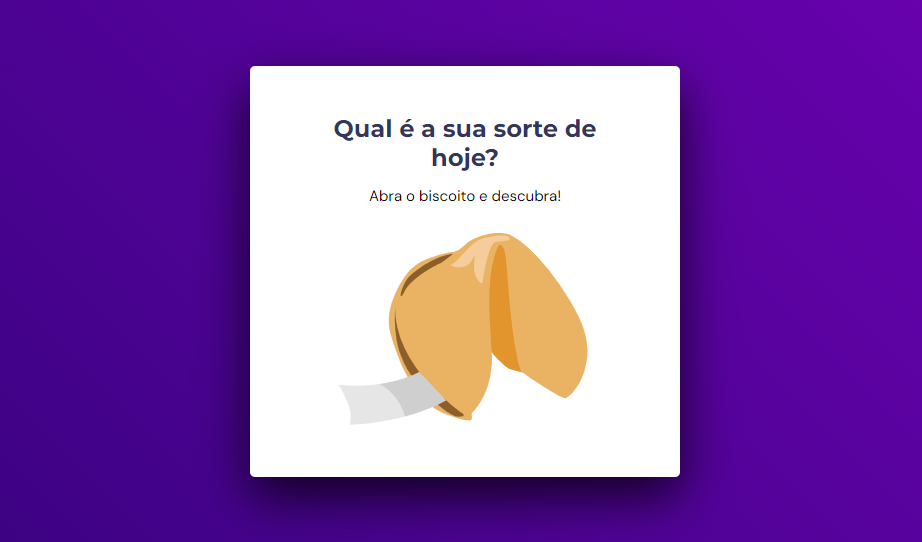

# Biscoito da Sorte 🥠

  

## 🖥️ Projeto

Esse foi um desafio proposto no Stage 05 da Rocketseat, a proposta do desafio foi criar um jogo chamado Biscoito da Sorte, 
no qual o usuário, a partir de um clique ou enter, abre um biscoito com a sua sorte do dia.
Neste desafio foi usado os seguintes conhecimentos:
- Estrutura de dados HTML
- Animações com CSS
- Funções no Javascript
- Manipulação da DOM
- Biblioteca JS Math()
- Funções *callback*
- Arrays

## 🚀 Tecnologias

- HTML
- CSS
- JS
- Figma

## 🏷️ Layout

Você pode visualizar o layout do projeto através [desse link](<https://www.figma.com/community/file/1182751789348533739>) e o projeto pode ser acessado através [desse link](<https://biscoito-da-sorte-liard.vercel.app/>) 
